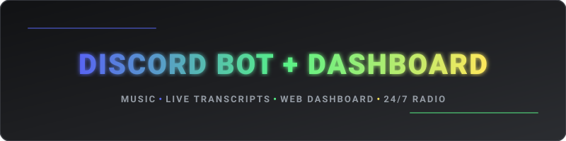
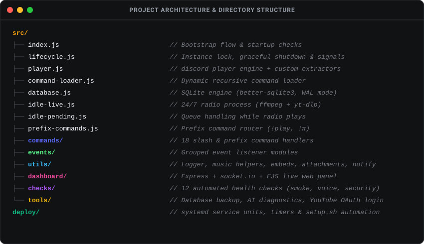

<div align="center">



[](#)
[](#)
[](#)
[](#)
[](#)
[](#-license)

<br>

Discord bot με μουσική υψηλής ποιότητας, αρχειοθέτηση μηνυμάτων και ζωντανό web dashboard.  
*Επειδή το να στήσεις δικό σου bot είναι ο μόνος τρόπος να μη σου ζητάει κανείς premium συνδρομή για 24/7 ραδιόφωνο.*

<br>


</div>

### 🌟 Βασικές Δυνατότητες

- 🎵 **Μουσική & 24/7 Ραδιόφωνο:** Αναπαραγωγή από YouTube ή Spotify (`/play`), πλήρης ουρά (`/queue`, `/skip`, `/shuffle`, `/loop`), και αυτόνομο ραδιόφωνο (`/idlemusic`) που επανασυνδέεται αυτόματα μετά από reboot ή crash.
- 💬 **DM Support & Προαιρετικό AI:** Πλήρης υποστήριξη ιδιωτικών μηνυμάτων (`/help`, `/ask`). Με δωρεάν `GEMINI_API_KEY` ενεργοποιείται φυσική κουβέντα με αυστηρά read-only δικαιώματα (δεν εκτελεί καταστροφικές εντολές).
- 🛡️ **Διαχείριση & Transcripts:** Deep-delete καθαρισμός (`/clear`) πέρα από το όριο των 14 ημερών του Discord, πλήρη transcripts με συνημμένα αρχεία, και καταγραφή προσκλήσεων (`/invite-logger`).
- 📊 **Ζωντανό Web Dashboard:** Web UI (Express + EJS + socket.io) με ζωντανά στατιστικά, έλεγχο του player σε πραγματικό χρόνο και προεπισκόπηση transcripts.

<br>

<div align="center">
  
</div>

### 📁 Δομή Αρχείων & Αρχιτεκτονική

<div align="center">
  
</div>

<br>

<div align="center">
  
</div>

### 📖 Αναλυτικοί Οδηγοί & Τεκμηρίωση

<details>
<summary><strong>⚡ Γρήγορη Εκκίνηση (Τοπικά)</strong></summary>

<br>

```bash
npm ci
cp .env.example .env    # συμπλήρωσε DISCORD_BOT_TOKEN και CLIENT_ID
npm start
```

- **Απαιτήσεις:** Node 22 LTS.
- **Intents:** Στο Discord Developer Portal ενεργοποίησε τα privileged intents: *Message Content* και *Server Members*.
- **Dashboard:** Πρόσβαση στο `http://127.0.0.1:3000`.

</details>

<br>

<details>
<summary><strong>🧪 Αυτοματοποιημένοι Έλεγχοι (Health & Smoke Checks)</strong></summary>

<br>

Όλοι οι έλεγχοι τρέχουν αυτόνομα μέσω του runner (`src/checks/`):

```bash
npm test                 # Όλοι οι έλεγχοι
npm run smoke            # Υγεία modules, εντολών, βάσης και στοίβας ήχου
npm run lint             # Στατικός έλεγχος μεταβλητών και runtime σφαλμάτων
npm run backup           # Άμεσο αντίγραφο της βάσης SQLite
npm run diag:ai          # Έλεγχος διαθεσιμότητας μοντέλων Gemini
npm run diag:extractors   # Έλεγχος λειτουργίας audio extractors
npm run diag:emoji       # Έλεγχος application vs guild emoji
npm run yt:login         # OAuth login flow για YouTube
```

**Μεμονωμένοι έλεγχοι:**
```bash
node src/checks/run.js smoke         # Modules, συμβόλαιο εντολών, βάση, ήχος
node src/checks/run.js music         # Βοηθοί μουσικής + state restore + 24/7
node src/checks/run.js voice         # Αποσύνδεση από άδειο κανάλι
node src/checks/run.js dm            # Έλεγχος πρόσβασης εντολών στα DM
node src/checks/run.js ai            # Ασφάλεια και ιδιωτικότητα AI
node src/checks/run.js security      # Auth του dashboard, XSS, voice gateway
```

</details>

<br>

<details>
<summary><strong>⚙️ Ρυθμίσεις & Περιβάλλον (.env Reference)</strong></summary>

<br>

| Μεταβλητή | Περιγραφή |
|---|---|
| `DISCORD_BOT_TOKEN`, `CLIENT_ID` | Απαραίτητα διαπιστευτήρια Discord Bot |
| `BOT_OWNER_ID` | Ειδοποιήσεις βλάβης σε DM + πλήρη δικαιώματα ιδιοκτήτη |
| `DASHBOARD_PASSWORD`, `DASHBOARD_SECRET` | Κωδικός και cookie secret εισόδου στο Web Dashboard |
| `IDLE_MUSIC_URL` | Πηγή συνεχούς 24/7 ραδιοφώνου (προτίμησε Icecast stream) |
| `YT_COOKIE`, `YT_COOKIES_FILE` | YouTube cookies για αποφυγή rate-limits σε datacenter IPs |
| `ATTACHMENT_MAX_MB` | Όριο μεγέθους ανά αρχειοθετημένο αρχείο (default: 25MB) |
| `LOG_LEVEL` | Επίπεδο καταγραφής (`error`, `warn`, `info`, `debug`) |

</details>

<br>

<details>
<summary><strong>☁️ Οδηγός Deployment 24/7 (VPS & Services)</strong></summary>

<br>

Πλήρης οδηγός βρίσκεται στο **[DEPLOY.md](DEPLOY.md)**.

- **Υποδομή:** Linux VPS (~$12/χρόνο).
- **Διαχείριση:** `systemd` service units με αυτόματο restart σε crash ή reboot.
- **Εξωτερική Πρόσβαση:** Cloudflare Tunnel για ασφαλή σύνδεση στο dashboard χωρίς άνοιγμα ports.
- **Backups:** Αυτόματα νυχτερινά αντίγραφα SQLite σε ξεχωριστό ιδιωτικό repository.

```bash
sudo bash deploy/setup.sh
```

</details>

<br>

<details>
<summary><strong>💡 Τεχνικές Σημειώσεις & Audio Engine</strong></summary>

<br>

- **Διπλή Διαδρομή Ήχου:** 
  - Ο `/play` περνά από το `discord-player` (native encoder `mediaplex`).
  - Το 24/7 ραδιόφωνο περνά από `@discordjs/voice` + `prism-media` που αναζητά `@discordjs/opus` (αποφεύγοντας τον βαρύ JS encoder).
- **YouTube Cookies:**
  - `YT_COOKIE`: Raw `Cookie:` header για το `discord-player`.
  - `YT_COOKIES_FILE`: Αρχείο μορφής Netscape για το `yt-dlp` του ραδιοφώνου.
- **FFmpeg Isolation:**
  - Σε production περιβάλλον χρησιμοποιείται το native FFmpeg του συστήματος μέσω `FFMPEG_PATH`.

</details>

<br>

---

### 📄 License

This project is proprietary and source-available for personal community use.  
© 2026 **Thomas Thanos**. All rights reserved.

<br>

<div align="center">

[](#)

</div>
